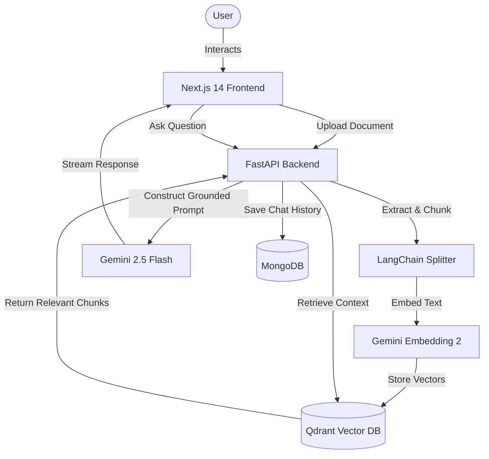

# Ragasiyam RAG Assistant

Ragasiyam is a completely grounded, state-of-the-art Retrieval-Augmented Generation (RAG) Chatbot. It answers questions strictly based on the documents you upload, explicitly preventing hallucinations. If the answer is not in your documents, it simply tells you it doesn't know.

## Architecture



## Tech Stack
- **Frontend:** Next.js 14 (App Router), Tailwind CSS, Lucide Icons
- **Backend:** FastAPI, Python 3.12
- **Vector Database:** Qdrant (Dockerized)
- **Primary Database:** MongoDB Atlas (for chat history)
- **AI Models:** Google Gemini (`gemini-2.5-flash` for generation, `gemini-embedding-2` for embeddings)
- **Text Processing:** LangChain (`RecursiveCharacterTextSplitter`)

## Features
- **Strict Grounding:** Mathematically and prompt-enforced zero-hallucination guarantee.
- **Context-Aware:** Remembers previous conversation history per session.
- **Fast Streaming:** Utilizes Server-Sent Events (SSE) for real-time response streaming.
- **Modern UI:** Clean, responsive, shadcn-inspired interface built with Tailwind CSS.

## Setup Instructions

### Prerequisites
- Node.js (v18+)
- Python (v3.10+)
- Docker Desktop
- MongoDB Atlas cluster URL
- Google Gemini API Key

### 1. Database Setup
Start the local Qdrant vector database using Docker:
```bash
docker-compose up -d
```

### 2. Backend Setup
Navigate to the backend directory, set up your environment variables, and start the API.
```bash
cd backend

# Create a virtual environment
python -m venv .venv
# Activate it (Windows)
.venv\Scripts\activate

# Install dependencies
pip install -r requirements.txt

# Configure environment variables
copy .env.example .env
# --> Edit .env with your GEMINI_API_KEY and MONGODB_URI

# Run the backend
uvicorn main:app --reload --host 0.0.0.0 --port 8000
```

### 3. Frontend Setup
Navigate to the frontend directory and start the Next.js development server.
```bash
cd frontend

# Install dependencies
npm install

# Run the frontend
npm run dev
```

Open your browser and navigate to **http://localhost:3000** to start chatting with Ragasiyam!
