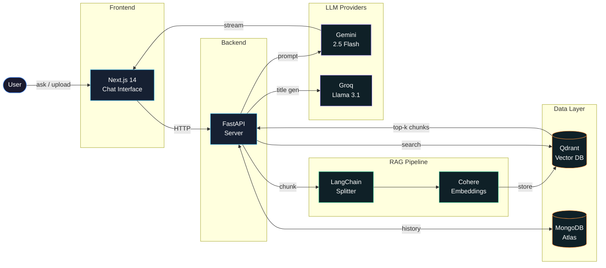

# RAG'asiyam

RAG'asiyam is an intelligent, full-stack conversational assistant powered by Retrieval-Augmented Generation (RAG). Featuring a premium Claude-inspired user interface, it seamlessly handles textual conversations, contextual document Q&A, and multimodal image analysis.

## Architecture



## Features

- **Contextual RAG (Document Q&A):** Upload PDF or TXT files. RAG'asiyam automatically ingests the documents into a vector database and grounds its answers based on your data.
- **Multimodal Vision:** Upload images (JPEG, PNG, WebP, GIF) to ask questions, describe content, or analyze visual data effortlessly using Gemini Vision models.
- **Premium User Interface:** A sleek, Claude-inspired design with an ambient pulsing glow around the input box, smooth micro-animations, and a responsive layout.
- **Dark Mode Support:** Visually stunning dark and light modes, fully togglable via the user settings modal and persisted to your local storage.
- **Persistent Sessions:** Your chat history is saved securely, allowing you to revisit and continue previous conversations from the sidebar.

## Tech Stack

**Frontend:**
- Next.js 14 (App Router, Turbopack)
- React & Tailwind CSS
- Lucide React (Icons)

**Backend:**
- FastAPI (Python 3.12)
- Qdrant (Dockerized Vector Database for RAG)
- MongoDB Atlas (Session & Chat History Storage)
- Google Gemini API (`gemini-2.5-flash` for generation, `gemini-embedding-2` for embeddings)
- LangChain (`RecursiveCharacterTextSplitter` for document chunking)

---

## Setup Instructions

### Prerequisites
- Node.js (v18+)
- Python (v3.10+)
- Docker Desktop
- MongoDB Atlas cluster URL
- Google Gemini API Key
- Qdrant Cloud URL & API Key (if using Cloud instead of Docker)

### 1. Database Setup
Start the local Qdrant vector database using Docker:
```bash
docker-compose up -d
```

### 2. Backend Setup
Navigate to the backend directory, set up your environment variables, and start the API.
```bash
cd backend

# Create a virtual environment
python -m venv .venv
# Activate it (Windows)
.venv\Scripts\activate

# Install dependencies
pip install -r requirements.txt

# Configure environment variables
cp .env.example .env
# Edit .env and fill in your GEMINI_API_KEY, QDRANT_URL, QDRANT_API_KEY, and MONGODB_URI

# Run the backend
uvicorn main:app --reload --host 0.0.0.0 --port 8000
```

### 3. Frontend Setup
Navigate to the frontend directory and start the Next.js development server.
```bash
cd frontend

# Install dependencies
npm install

# Run the frontend
npm run dev
```

Open your browser and navigate to **http://localhost:3000** to start interacting with RAG'asiyam!

---

## License
This project is open source and available under the MIT License.
